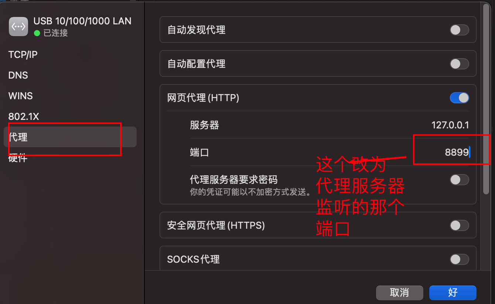
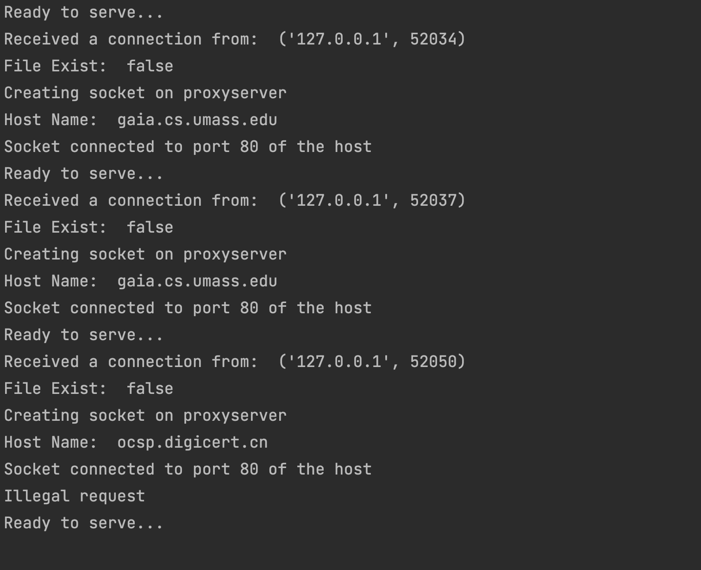

# 运行web代理服务器

## 步骤一：运行代理服务器

```python
from socket import *

# 创建socket，绑定到端口，开始监听
tcpSerPort = 8899
tcpSerSock = socket(AF_INET, SOCK_STREAM)

# Prepare a server socket
tcpSerSock.bind(('', tcpSerPort))
tcpSerSock.listen(5)

while True:
    # 开始从客户端接收请求
    print('Ready to serve...')
    tcpCliSock, addr = tcpSerSock.accept()
    print('Received a connection from: ', addr)
    message = tcpCliSock.recv(4096).decode()

    # 从请求中解析出filename
    # 假设请求为： http://gaia.cs.umass.edu/wireshark-labs/INTRO-wireshark-file1.html
    filename = message.split()[1].partition("//")[2].replace('/', '_')
    # 此时的filename = gaia.cs.umass.edu_wireshark-labs_INTRO-wireshark-file1.html
    fileExist = "false"
    try:
        # 检查缓存中是否存在该文件
        f = open(filename, "r")
        outputdata = f.readlines()
        fileExist = "true"
        print('File Exists!')

        # 缓存中存在该文件，把它向客户端发送
        for i in range(0, len(outputdata)):
            tcpCliSock.send(outputdata[i].encode())
        print('Read from cache')

    # 缓存中不存在该文件，异常处理
    except IOError:
        print('File Exist: ', fileExist)
        if fileExist == "false":
            # 在代理服务器上创建一个tcp socket
            print('Creating socket on proxyserver')
            c = socket(AF_INET, SOCK_STREAM)

            # hostn = gaia.cs.umass.edu
            hostn = message.split()[1].partition("//")[2].partition("/")[0]
            print('Host Name: ', hostn)
            try:
                # 连接到远程服务器80端口
                c.connect((hostn, 80))
                print('Socket connected to port 80 of the host')

                c.sendall(message.encode())
                # Read the response into buffer
                buff = c.recv(4096)

                tcpCliSock.sendall(buff)  # 发给客户端
                # Create a new file in the cache for the requested file.
                # Also send the response in the buffer to client socket
                # and the corresponding file in the cache
                tmpFile = open("./" + filename, "w")
                tmpFile.writelines(buff.decode().replace('\r\n', '\n'))
                tmpFile.close()

            except:
                print("Illegal request")
        else:
            # HTTP response message for file not found
            # Do stuff here
            print('File Not Found...Stupid Andy')
    # Close the client and the server sockets
    tcpCliSock.close()

tcpSerSock.close()

```

在pychar中运行这段代码。

## 步骤二：打开浏览器代理

以mac为例子：

 

## 步骤三：打开网址，进行访问

网址：http://gaia.cs.umass.edu/wireshark-labs/INTRO-wireshark-file1.html

选择的浏览器：safari

 

服务器输出：

 

当我们再次请求的时候：它就直接返回结果了。

